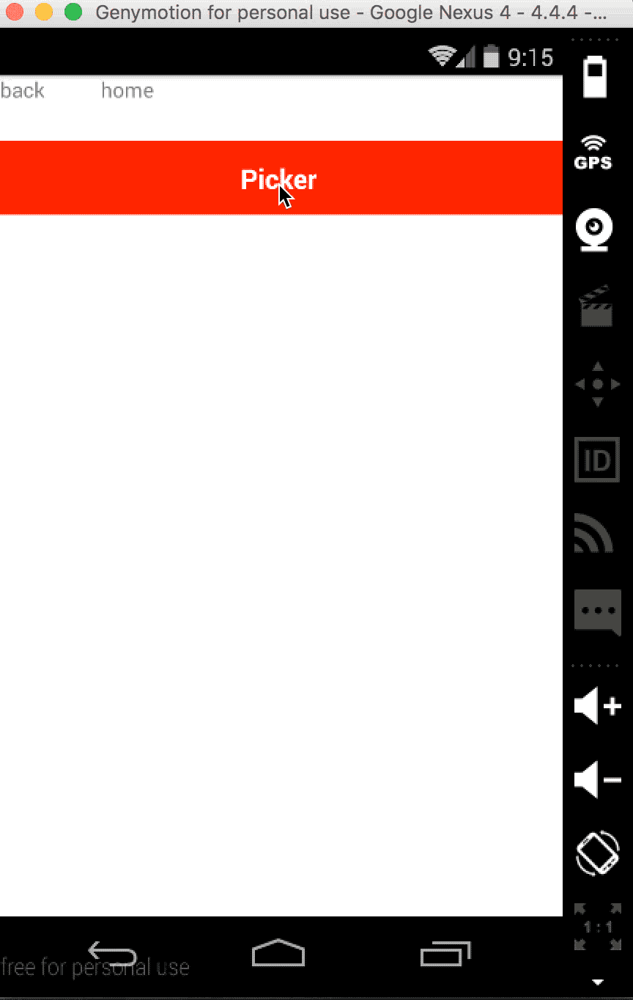
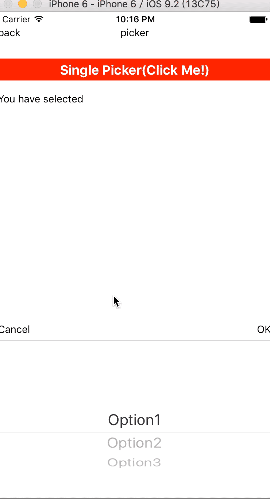

# react-native-picker
<!-- badge -->
[](https://travis-ci.org/MonkeyKingPlus/react-native-picker)
[](https://www.npmjs.com/package/mkp-react-native-picker)
[](https://www.npmjs.com/package/mkp-react-native-picker)
[](https://www.npmjs.com/package/mkp-react-native-picker)
[](https://www.npmjs.com/package/mkp-react-native-picker)
<!-- endbadge -->
Cross platform picker for IOS and Android.
It is based on PickerIOS for IOS while [react-native-wheel](https://github.com/shexiaoheng/react-native-wheel) for android.

 

# Guide
## npm install
    $ npm i mkp-react-native-picker --save
## Update Gradle Settings
    // file: android/settings.gradle
    ...
    include ':react-native-wheel'
    project(':react-native-wheel').projectDir = new File(rootProject.projectDir, '../node_modules/react-native-wheel/android')
## Update app Gradle Build
    // file: android/app/build.gradle
    ...
    
    dependencies {
      ...
      compile project(':react-native-wheel')
    }
## Register React Package
    // file: android/src/main/java/com.xx/MainApplication.java
    ...
    
    private final ReactNativeHost mReactNativeHost = new ReactNativeHost(this) {
        @Override
            protected boolean getUseDeveloperSupport() {
                return BuildConfig.DEBUG;
            }
    
            @Override
            protected List<ReactPackage> getPackages() {
                return Arrays.<ReactPackage>asList(
                    new MainReactPackage(),
                    new WheelPackage()          // Added there
                );
            }
        };
## Usage
```js
import React ,{Component}from 'react';
import {
    StyleSheet,
    Text,
    View,
    TouchableOpacity,
    Platform
} from 'react-native';

import BaseComponent from './baseComponent';
import SinglePicker from 'mkp-react-native-picker';

import {viewStyles} from '../themes/default';

const options = [{
    key: 1,
    value: "Option1"
}, {
    key: 2,
    value: "Option2"
}, {
    key: 3,
    value: "Option3"
}]

const another_options = [{
    key: 1,
    value: "OptionA"
}, {
    key: 2,
    value: "OptionB"
}, {
    key: 3,
    value: "OptionC"
}];

const optionsGroup = [options, another_options]

export default class Picker extends BaseComponent {
    constructor(props) {
        super(props);
        this.state = {
            selected: ''
        }
        this.optionsGroupIndex = 0
    }

    render() {
        return <View style={viewStyles.main}>
            <TouchableOpacity
                style={{height:30,flexDirection:'row',justifyContent:'center',alignItems:'center',backgroundColor:'red'}}
                onPress={()=>{
                    this.singlePicker.show();
                }}>
                <Text style={{fontSize:18,color:'white',fontWeight:'bold'}}>Single Picker(Click Me!)</Text>
            </TouchableOpacity>

            <View style={{height:50,justifyContent:'center'}}><Text>You have
                selected {this.state.selected}</Text></View>

            <TouchableOpacity
                style={{height:30,flexDirection:'row',justifyContent:'center',alignItems:'center',backgroundColor:'red'}}
                onPress={()=>{
                    this.optionsGroupIndex = Math.abs(this.optionsGroupIndex - 1)
                    this.singlePicker.setOption(optionsGroup[this.optionsGroupIndex]);
                }}>
                <Text>Switch Options</Text>
            </TouchableOpacity>

            <SinglePicker
                lang="en-US"
                ref={ref=>this.singlePicker=ref}
                onConfirm={(option)=>{
                    //this.setState({selected:option.value})
                }}
                onSelect={(option)=>{
                    this.setState({selected:option.value})
                }}
                options={options}
            >

            </SinglePicker>
        </View>
    }
}
```
    
# Documentation

## Properties
Key | Type | Required | Default | Description
--- | ---- | -------- | ------- | -----------
options | array | yes | | must be an array of key-value pairs,like {key:1,value:'option'}
lang | string | no | 'zh-CN' | enums:'zh-CN','en-US','es-AR',indicate the language of the text in buttons
style | object | no | {backgroundColor: "white"} | 
defaultSelectedValue | any | no |  | key of each option,if undefined, the first option will be selected
onConfirm | function | no | | option that be selected as the parameter
onSelect | function | no | | option that be selected as the parameter
onCancel | function | no | |     

## Methods
Name | Description
---- | -----------
show | show the Picker
hide | hide the Picker
setOption(options,defaultSelectedValue) | change options of the Picker
